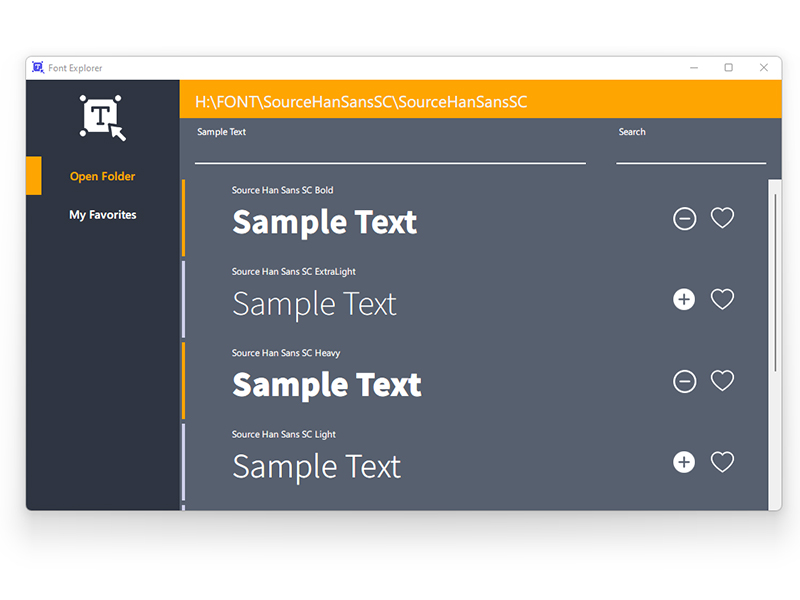

# FontExplorer

I find it really hard to use fonts resource when doing some design work. There is a ton of font files that can not be previewed, and if I install them all, my system must crash! On the other hand, even if I install some font to perview it, uninstall it is really inconvient.

So, I write this small application.

## Here is how it works

This app only include one single exe file.

First, [download](https://github.com/jiwenyoung/FontExplorer/releases/download/First_Version_1.0.0/FontExplorer.exe) it and save it to a folder, and run the single exe file, it will create a folder named "My Favorites" in the same folder, and this is where your favorites fonts will be saved.

Click "Open Folder" button or directly drap a folder into it, and it will show the fonts preview in the folder you choose or drag in. You can also drag single font file or multi font files to preview and perform some other operation like load.

Load Feature: You can click the plus button beside your font sample text to load it. After load it, you can use it in other applications like Photoshop, Microsoft Word, etc. After loaded, the plus button will become minus button, which will be unload this font. It is a good habit of unload a font after using it, because while loaded, the font file is blocked, that means, you can not delete it or modify it.

My Favorite Feature: You can use heart button beside sampe text of font to do "add to favorites" and "remove from favories" operation. "add to favorites" will copy the font you just added to the "My Favorites" Folder, and "remove from favories" just remove it from that folder.

Preview: You can input 12 chars in "Sample Text" to visualize what you input in these fonts.

Search: search font name in font list

Okay, that's all until now, enjoy it.

---

在设计工作中，字体管理一直是一个很头疼的问题。 一堆的字体文件，无法预览，如果把他们全装上，系统要崩了！ 如果 安装->预览, 那么安装和卸载字体也很麻烦。

所以我做了这个应用。

## 它怎么工作？

这是一个单exe程序。

[下载](https://github.com/jiwenyoung/FontExplorer/releases/download/First_Version_1.0.0/FontExplorer.exe)它，把它放入你想要的文件夹，然后运行它。 它会创建一个"My Favorites"文件夹, 你收藏的字体会存在这里面。

单击侧边栏的“打开文件夹”按钮, 选择一个文件夹，这个程序会显示此文件夹下的所有字体文件的预览，你也可以拖拽一个文件夹或者一个/多个文件进来

加载：单击字体旁边的加号按钮，这个字体会被临时加载，你可以在其他程序比如Photoshop , Microsoft Word里面使用这个字体。 建议您在不需要的时候卸载字体,因为在加载状态下，这个字体文件将被锁死，不能删除也不能修改。在加载状态下，加号按钮会变成减号，用这个按钮卸载

收藏：字体预览旁边的心形按钮用来做“加入收藏夹”和“从收藏夹移除”操作。这个操作其实就是把你要收藏的字体文件拷贝到“My Favorites”文件夹里面，以及从这个文件夹移除

预览: 在样本文字输入框输入不超过12个字，你就能看到这些字以各种字体展现

搜索：以字体名搜索字体

